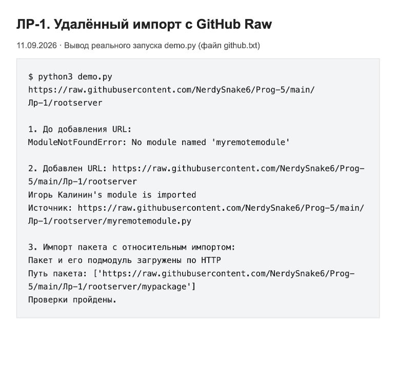

# Лабораторная работа 1. Удалённый импорт

Автор: Игорь Калинин.

Сделал импорт модуля по HTTP через `requests`, обработку недоступного
сервера (*) и загрузку пакета (***).

Основной хостинг — [GitHub Pages](https://nerdysnake6.github.io/Prog-5/Лр-1/rootserver/).
Модуль и пакет доступны по публичному HTTPS-адресу.

## Файлы

- `activation_script.py` — `url_hook`, `URLFinder` и `URLLoader`.
- `rootserver/myremotemodule.py` — модуль с функцией `myfoo()`.
- `rootserver/mypackage/` — пакет с относительным импортом из `helpers.py`.
- `demo.py` — запуск проверок.
- `results/` — сохранённый вывод запусков и HTML для его просмотра.
- `screenshots/` — скриншоты страниц с этим выводом.

## 1. Удалённый импорт и requests

Команды ниже выполняются из папки `Лр-1`. Сначала установить зависимость:

```bash
python3 -m venv .venv
source .venv/bin/activate
python3 -m pip install -r requirements.txt
```

### Проверка с GitHub Pages

Локальный сервер запускать не нужно:

```bash
python3 demo.py https://nerdysnake6.github.io/Prog-5/Лр-1/rootserver
```

Для ручной проверки запустить `python3 -i activation_script.py` и вводить
команды по очереди:

```python
import myremotemodule  # ModuleNotFoundError: URL ещё не добавлен
sys.path.append("https://nerdysnake6.github.io/Prog-5/Лр-1/rootserver")
import myremotemodule
myremotemodule.myfoo()
import mypackage
print(mypackage.hello())
```

Файлы публикуются из ветки `main`, из корня репозитория. Файл `.nojekyll`
нужен, чтобы GitHub Pages отдавал исходные файлы, включая `__init__.py`.
В каталоге `rootserver` есть страница со ссылками на модуль и файлы пакета.

Проверка прошла: модуль, пакет и его подмодуль загружены именно с
`nerdysnake6.github.io`. Вывод сохранён в `results/pages.txt`.


### Локальная проверка из задания

В первом терминале запустить сервер:

```bash
python3 -m http.server 8000 --bind 127.0.0.1 --directory rootserver
```

Во втором терминале, тоже из `Лр-1`:

```bash
source .venv/bin/activate
python3 -i activation_script.py
```

Затем вводить команды по очереди:

```python
import myremotemodule  # ModuleNotFoundError: URL ещё не добавлен
sys.path.append("http://localhost:8000")
import myremotemodule
myremotemodule.myfoo()
```

После добавления адреса выводится `Игорь Калинин's module is imported`.
Ту же проверку вместе с импортом пакета можно выполнить одной командой:

```bash
python3 demo.py http://localhost:8000
```


В `sys.path_hooks` добавлена функция `url_hook`. Для HTTP-адреса она создаёт
`URLFinder`, который ищет файл модуля. `URLLoader` получает исходный код через
`requests.get()` и выполняет его через `compile()` и `exec()`.

В качестве другого хостинга использовал GitHub Raw. Код лежит в этом же
репозитории. Локальный сервер для этой проверки не нужен:

```bash
python3 demo.py https://raw.githubusercontent.com/NerdySnake6/Prog-5/main/Лр-1/rootserver
```



GitHub Raw не показывает список файлов каталога, поэтому вместо разбора HTML
поисковик проверяет прямые адреса `имя/__init__.py` и `имя.py`.
Ответ 404 для файла означает, что надо попробовать следующий вариант.
В `url_hook` ответы 400 и 404 для самого каталога разрешены.

## 2. Недоступный сервер (*)

Остановить сервер в первом терминале через Ctrl+C и запустить новый процесс:

```bash
python3 demo.py http://localhost:8000 --unavailable
```


У запросов задан `timeout=5`. Ошибки подключения, тайм-ауты и ошибки HTTP
обрабатываются через `requests.RequestException`. Хук сообщает, что сервер
недоступен, и выбрасывает `ImportError`. Python пробует другие пути и в итоге
выдаёт `ModuleNotFoundError`, который перехватывает демонстрационный скрипт.
Ошибки при поиске или загрузке файла также преобразуются в `ImportError`.

Для повторной проверки нужен новый процесс: уже импортированный модуль
сохраняется в `sys.modules` и повторный `import` может не обращаться к серверу.

## 3. Загрузка пакета (***)

В интерактивном режиме после добавления URL GitHub Pages:

```python
import mypackage
print(mypackage.hello())
print(mypackage.__path__)
```

Результат — `Пакет и его подмодуль загружены по HTTP`.
Это также проверяется в `demo.py` при загрузке с любого из указанных хостингов.

Для `__init__.py` в `spec_from_loader` передаётся `is_package=True`.
В `spec.submodule_search_locations` записывается URL каталога пакета.
Он становится `mypackage.__path__`, поэтому относительный импорт
`from .helpers import hello` ищет `helpers.py` в этом удалённом каталоге.
Для подмодуля используется последняя часть имени: `helpers`, а не
`mypackage.helpers`. Реализованы обычные пакеты с `__init__.py`.

## Результат

Модуль и пакет загрузились с GitHub Pages, GitHub Raw и localhost. При выключенном сервере
ошибка обработана. Скриншоты сделаны в браузере по сохранённому выводу реальных
запусков от 11.09.2026; исходные логи находятся в `results/*.txt`.

Загруженный Python-код выполняется в текущем процессе, поэтому для проверки
используются собственные файлы.

Материалы: [задание](https://gist.github.com/nzhukov/919cd2864a4828f65625fb3f5cea7cec),
[importlib](https://docs.python.org/3/library/importlib.html),
[requests](https://requests.readthedocs.io/en/latest/user/quickstart/).
