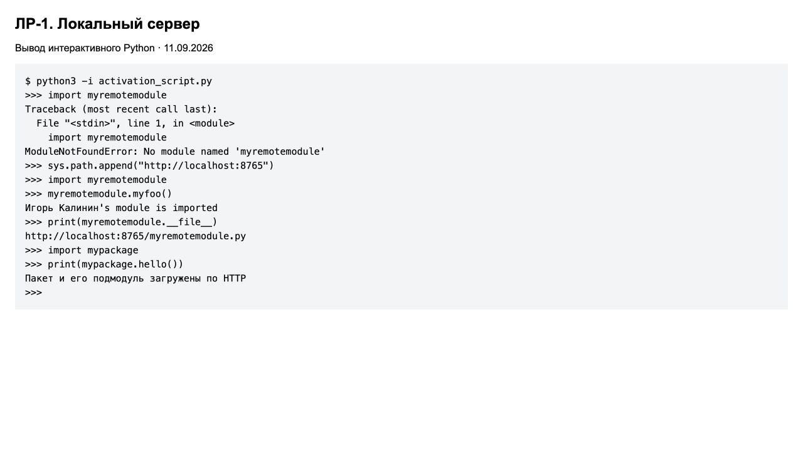
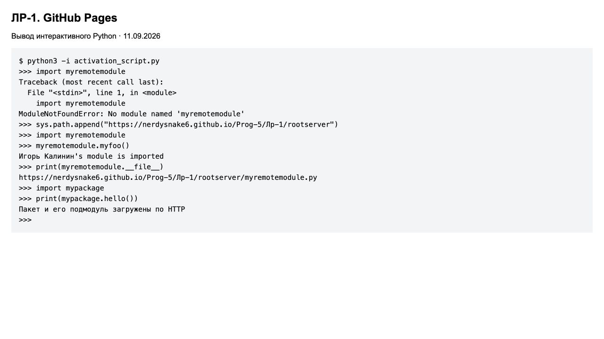
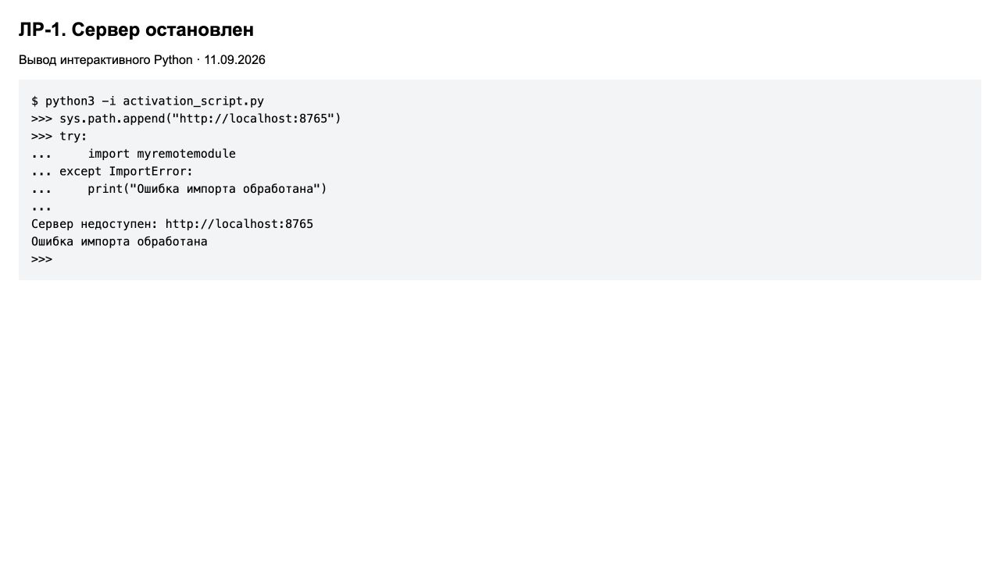

# ЛР-1. Удалённый импорт

Игорь Калинин.

Цель работы — импортировать Python-модуль с HTTP-сервера, проверить другой
хостинг, использовать `requests`, обработать недоступный сервер и загрузить пакет.
Ниже отдельно описаны все восемь пунктов задания.

## Подготовка

Все команды выполняются из папки `Лр-1`. Сначала установить зависимость:

```bash
python3 -m venv .venv
source .venv/bin/activate
python3 -m pip install -r requirements.txt
```

В каждом новом терминале для работы с лабораторной нужно перейти в `Лр-1`
и выполнить `source .venv/bin/activate`.

## 1. Создание удалённого модуля

Создал файл [rootserver/myremotemodule.py](rootserver/myremotemodule.py).
В нём находится функция `myfoo()`, которая выводит имя автора:

```python
def myfoo():
    """Вывести имя автора модуля."""
    author = "Игорь Калинин"
    print(f"{author}'s module is imported")
```

Папка `rootserver` служит корнем HTTP-сервера. Модуль лежит в ней,
а не рядом с `activation_script.py`, поэтому обычный импорт до добавления URL
его не находит.

## 2. Создание механизма импорта

В файле [activation_script.py](activation_script.py) разместил три части:

- `url_hook` распознаёт адреса `http://` и `https://` в путях поиска Python.
- `URLFinder` ищет на сервере пакет `имя/__init__.py` или модуль `имя.py`.
- `URLLoader` скачивает исходный код и выполняет его внутри создаваемого модуля.

`create_module()` возвращает `None`, поэтому сам объект модуля создаёт Python.
В `exec_module()` исходный код компилируется через `compile()` и выполняется
через `exec()`. Адрес файла сохраняется в `module.__file__`.

## 3. Запуск локального HTTP-сервера

В первом терминале запустить:

```bash
python3 -m http.server 8765 --bind 127.0.0.1 --directory rootserver
```

Параметр `--directory rootserver` задаёт корень сервера.
Модуль становится доступен по адресу `http://localhost:8765/myremotemodule.py`.
Использовал порт 8765, потому что 8000 во время проверки был занят.
Терминал с сервером должен оставаться открытым.

## 4. Подключение хука и проверка импорта

Во втором терминале запустить интерактивный Python:

```bash
python3 -i activation_script.py
```

При запуске скрипт регистрирует хук и очищает кеш поисковиков:

```python
sys.path_hooks.append(url_hook)
sys.path_importer_cache.clear()
```

Сначала ввести:

```python
import myremotemodule
```

Получается `ModuleNotFoundError: No module named 'myremotemodule'`.
Теперь добавить адрес сервера и повторить импорт:

```python
sys.path.append("http://localhost:8765")
import myremotemodule
myremotemodule.myfoo()
print(myremotemodule.__file__)
```

Результат:

```text
Игорь Калинин's module is imported
http://localhost:8765/myremotemodule.py
```

Модуль загрузился по HTTP. Его источник виден в `__file__`.



## 5. Проверка другого хостинга — GitHub Pages

Разместил файлы на [GitHub Pages](https://nerdysnake6.github.io/Prog-5/Лр-1/rootserver/).
Это публичный адрес, для него локальный сервер не нужен.

Открыть новый `python3 -i activation_script.py` и выполнить:

```python
sys.path.append("https://nerdysnake6.github.io/Prog-5/Лр-1/rootserver")
import myremotemodule
myremotemodule.myfoo()
print(myremotemodule.__file__)
```

Функция снова выводит имя автора. В `__file__` теперь находится адрес
`https://nerdysnake6.github.io/Prog-5/Лр-1/rootserver/myremotemodule.py`.
Это подтверждает загрузку с внешнего хостинга.

Новый процесс Python нужен, чтобы повторный импорт не использовал модуль,
который уже сохранён в `sys.modules` после локальной проверки.

GitHub Pages публикует файлы из корня ветки `main`. Файл `.nojekyll`
позволяет публиковать в том числе `__init__.py`.



## 6. Использование requests вместо urllib

В `url_hook` и `URLLoader` использовал `requests.get()` вместо `urlopen()`.
Например, загрузчик получает исходный код так:

```python
response = requests.get(url, timeout=5)
response.raise_for_status()
self.source = response.content
```

`raise_for_status()` проверяет ошибки HTTP, а `response.content` содержит
байты исходного кода. Найденный файл скачивается один раз.

Вместо разбора списка файлов через регулярное выражение поисковик проверяет
прямые адреса. Если сервер возвращает 404, он пробует следующий вариант.
Это позволяет работать с GitHub Pages без списка содержимого каталога.
В хуке 404 для самого каталога допускается: у каталога пакета может не быть
`index.html`, хотя файлы внутри доступны.

## 7. Обработка недоступного сервера (*)

Остановить локальный сервер через Ctrl+C. В новом
`python3 -i activation_script.py` выполнить:

```python
sys.path.append("http://localhost:8765")
try:
    import myremotemodule
except ImportError:
    print("Ошибка импорта обработана")
```

После последней строки нажать Enter ещё раз. Результат:

```text
Сервер недоступен: http://localhost:8765
Ошибка импорта обработана
```

У запросов задан `timeout=5`. Сетевые ошибки перехватываются через
`requests.RequestException`. Хук сообщает о недоступности сервера и выбрасывает
`ImportError`. Python продолжает поиск и, если модуль нигде не найден,
выдаёт `ModuleNotFoundError`. Это подкласс `ImportError`, поэтому показанный
`except` его перехватывает. Ошибки подключения при поиске файла также
преобразуются в `ImportError`.



## 8. Загрузка пакета (***)

Создал пакет из двух файлов:

```text
rootserver/mypackage/
├── __init__.py
└── helpers.py
```

В [helpers.py](rootserver/mypackage/helpers.py) функция `hello()` возвращает
сообщение. В [__init__.py](rootserver/mypackage/__init__.py) используется
относительный импорт `from .helpers import hello`.

В сеансе Python из пункта 5, где уже добавлен URL GitHub Pages, выполнить:

```python
import mypackage
print(mypackage.hello())
```

Результат:

```text
Пакет и его подмодуль загружены по HTTP
```

При обнаружении `__init__.py` поисковик передаёт в `spec_from_loader`
аргумент `is_package=True`. В `spec.submodule_search_locations` он записывает
URL каталога пакета. Этот список становится `mypackage.__path__`, и Python
ищет `helpers.py` по удалённому адресу при относительном импорте.
Для имени `mypackage.helpers` поисковик берёт последнюю часть — `helpers`.

Пакет проверен и локально, и на GitHub Pages. Результаты видны на скриншотах
в пунктах 4 и 5.

## Итог

Все восемь пунктов выполнены. Модуль и пакет импортируются с локального
сервера и GitHub Pages, а ошибка недоступного сервера обрабатывается.
Скриншоты показывают страницы с выводом реальных интерактивных запусков
от 11.09.2026.
